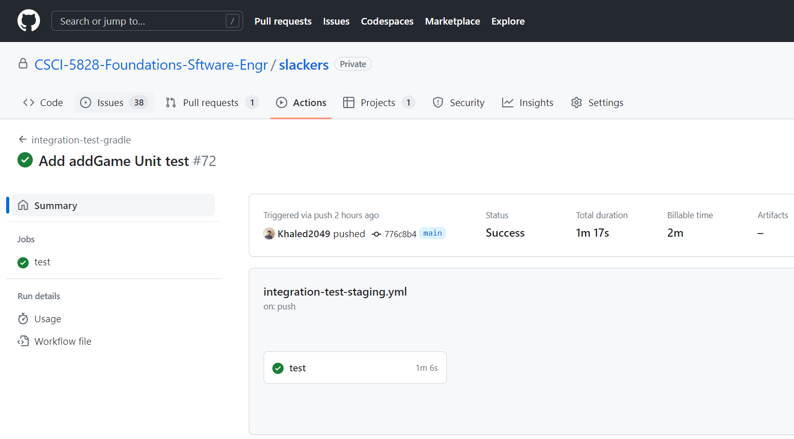
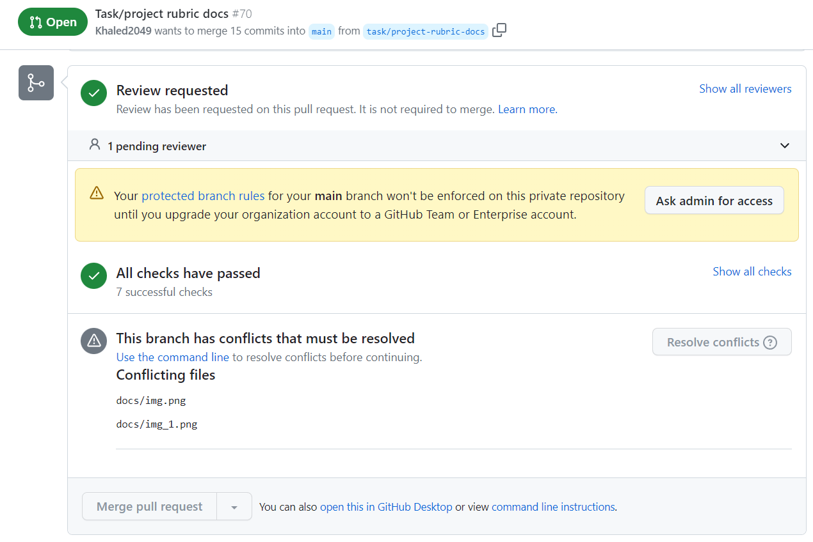
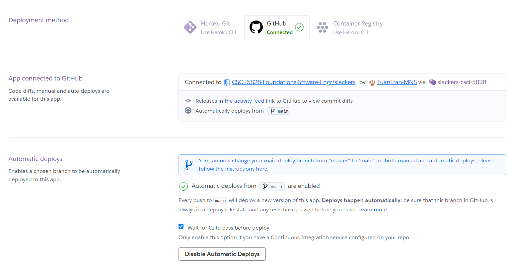
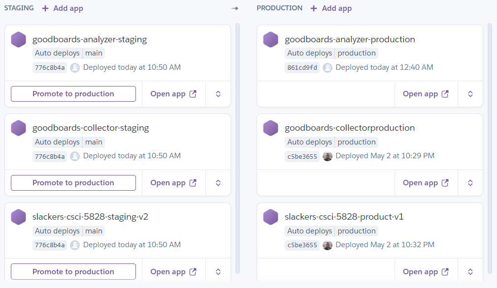

# Continuos Delivery

Our project uses GitHub action and Heroku pipeline to perform continuous delivery. 

## GitHub action

- Tests will be run on every feature branch push.

- Pull requests will be reviewed and merge into main after all comments are resolved.

## Heroku pipeline

- After merging a new pull request to main, if all tests passed, main will be automatically deploy on staging

- After testing our deployment on staging, if we are happy with the current version of the apps, main will be merged into production branch. 

- Similar to staging, production apps will be deployed automatically based on production branch if tests pass.

- Alternatively, we can manually promote apps from staging to production.

This way we can rapidly write, test, deploy, and deliver new version of our apps to the customers.