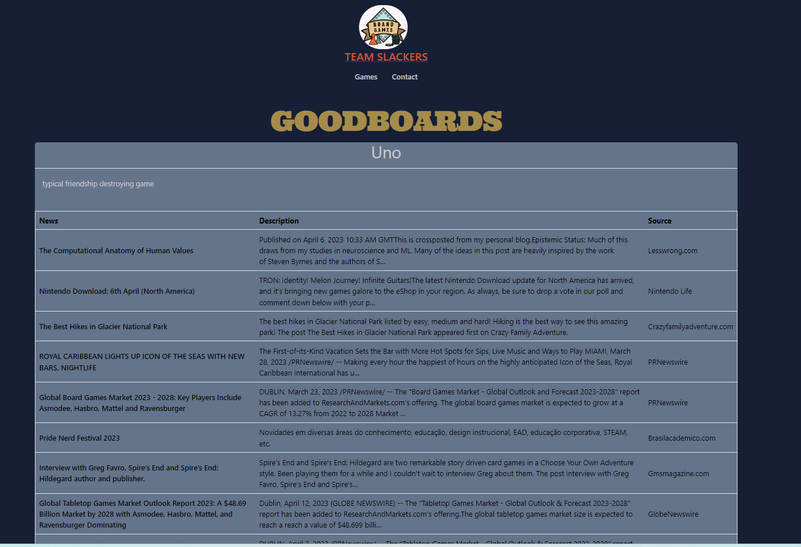
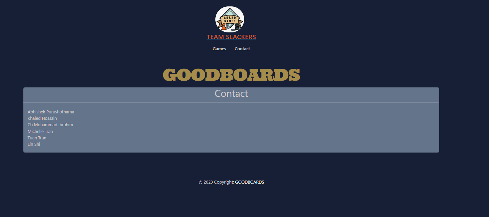

# Design

## Applications
Both due to the requirement for the course and it's compatibility to the goal we have three major components.
* Web Application
* Data Analyzer
* [Data Collector](#Collector)

## Games Page

## Game Detail Page

## Contact Page 

## Description
The current Goodboards contains two tabs: Games and Contact. Contact will display the list of all authors. Games will display a list of all games stored. 
Then when clicking on each game, the detail page will appear with the game name, its descriptions, and a news section.

## Routes
- /games: Lists game information and news
- /contact: Lists Contact information about developers
- /game/{id}: Display the individual game description and news. 

## News Retrieval

### Collector
`Collector` uses NewsAPI to retrieve news information and submit this into the redis queue.
- The scheduler operates on 30 minute intervals
- Calling NewsAPI for news, using `https://newsapi.org/v2/everything?q=${GAME_NAME}&language=en&pageSize=10&apiKey=${NEWS_API_KEY}`
  - Game names are found by querying the database for all current games. Note that an API request is made for each game name
  - Other parameters are for convenience, i.e. only searching for English articles and querying in small amounts for processing
- Uses environment variable `NEWS_API_KEY`. Keys can be generated for free [here](https://newsapi.org/)
- Each fetched articles is deserialized, and key information is repackaged into `NewsUnit` objects. 
  - `NewsUnit` objects contain article title, description, and the article's URL, as well as the UUID of the game it is associated with
  - These units of work are then serialized and pushed to redis

### Analyzer
`Analyzer` retrieve news information from the redis queue and store it into the `goodboards.news` table.
- The scheduler operates on 30 second intervals to check whether new items have been added to the queue. 
- When the news items is retrieved from the queue, it is deserialized into `NewsUnit` object.
  - It is deserialized using the Json package and the decodeFromString function. 
  - `NewsUnit` object contains article title, description, URL, and the UUID of the corresponding game. 
- Then a check with be completed to ensure the news article has not been included in the `goodboards.news` through the article title. 
- If the article does not exist in `goodboards.news`, the article will be added via [databaseInterface](https://github.com/CSCI-5828-Foundations-Sftware-Engr/slackers/blob/feature/collector/docs/database.md#database-interface). 
  - The newly added article contains the title, description, URL, UUID from the associated game, and a UUID for the news article. 

## Database
We are using a Postgres database. Some key design decisions:
- Our database is named `goodboards`, and all tables are defined under a single schema `goodboards`.
- Tables:
  - `games` - contains all game data. Tracks UUID, name, and description of the game
  - `news` - contains all news data per game retrieved from the database. Tracks the ID, title, and description of each news article.
- Only one connection to the database exists at any point. The connection is defined as a Singleton.

Read more [here](database.md).