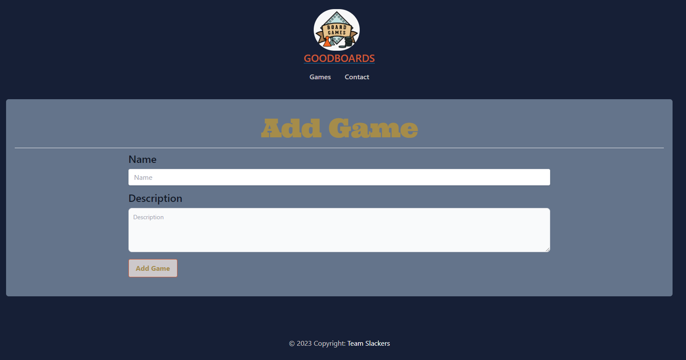
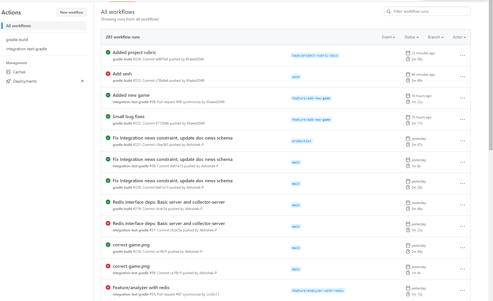
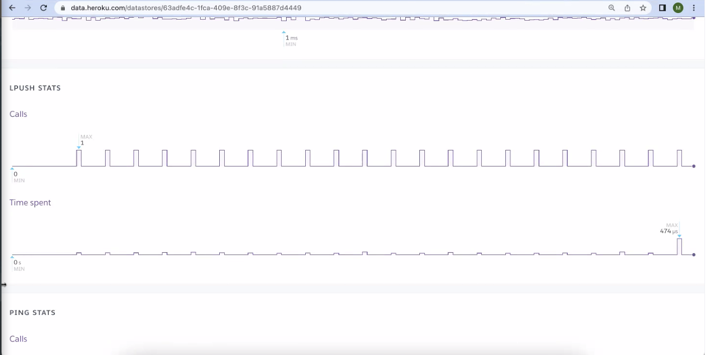

### Github URL: [Goodboards](https://github.com/CSCI-5828-Foundations-Sftware-Engr/slackers)

- [x] [Web application, basic form, reporting.](..%2F..%2Fapplications%2Fbasic-server%2Fsrc%2Fmain%2Fkotlin%2Fcom%2Fgoodboards%2Fapp%2FApp.kt)

Here we can see the form to add a game. Pressing the add game button takes the user to the home page. The server get the inputs and calls this DB method
```kotlin
    fun addGame(name: String, description: String) {
        val statement = "INSERT INTO goodboards.games(name, description) VALUES('$name','$description');"
        connection.prepareStatement(statement).execute()
}
```
- [x] [Data collection](..%2Fcomponents%2Fdata-collector)
- The code snippet below shows the collector worker class
```kotlin
class RetrieveNewsWorker(override val name: String = "data-collector") : Worker<RetrieveNewsTask> {

    private val logger = LoggerFactory.getLogger(this.javaClass)
    private val redisInterface = Wrapper.getRedisInterface()
    private val dbInterface = Wrapper.getDBInterface()
    private val apiKey = Wrapper.getEnv("NEWS_API_KEY")
    private val client = Wrapper.getHttpClient()
    private val format = Json {
        coerceInputValues = true
    }

    override fun execute(task: RetrieveNewsTask) {
        runBlocking {
            logger.info("starting data collection.")

            // Query news for all games in the database
            val games = dbInterface.getAllGames()
            val newsUnits = mutableListOf<String>()
            for(game in games) {

                // Format game name for API call
                val encodedName = URLEncoder.encode(game.name, "UTF-8")
                val url = "https://newsapi.org/v2/everything?q=$encodedName&language=en&pageSize=10&apiKey=$apiKey"

                // Get data and deserialize
                try {
                    // TODO: use a builder instead
                    val newsRaw: HttpResponse = client.get(url)
                    val newsResponse = format.decodeFromString<NewsResponse>(newsRaw.readText())

                    // Package response into units of work for redis
                    for(article in newsResponse.articles) {
                        if(article.title.isNotEmpty() && article.description.isNotEmpty() && article.url.isNotEmpty()) {
                            val unit = NewsUnit(game.uuid, article.title, article.description, article.url)
                            newsUnits.add(format.encodeToString(unit))
                        }
                    }
                } catch (e: Exception) {
                    logger.error("Failed to fetch news with error $e")
                }
            }

            // Put news in Redis if there is any
            logger.info(newsUnits.size.toString())
            if(newsUnits.isNotEmpty())
            {
                redisInterface.pushToList(name = "news:collect-analyze", newsUnits)
            }

            logger.info("completed data collection.")
        }
    }
}
```
- [x] [Data analyzer](..%2Fcomponents%2Fdata-analyzer)
- The code snippet below shows the analyzer worker class
```kotlin
class AnalyzerWorker(override val name: String = "data-analyzer") : Worker<AnalyzerTask> {
  private val logger = LoggerFactory.getLogger(this.javaClass)

  override fun execute(task: AnalyzerTask) {
    runBlocking {
      logger.info("starting data analysis.")

      val dbInterface = Wrapper.getDBInterface()
      val redisInterface = Wrapper.getRedisInterface()
      val redisQueue = redisInterface.getFromList("news:collect-analyze", 10)
      logger.info(redisQueue.size.toString())
      for (item in redisQueue) {
        val newsItem = Json.decodeFromString<NewsUnit>(item)
        newsItem.title = AnalyzerWorkerHelper.setDoubleApostrophe(newsItem.title)
        newsItem.description = AnalyzerWorkerHelper.setDoubleApostrophe(newsItem.description)
        val result = dbInterface.getNewsBasedOnTitle(newsItem.title)
        logger.info("results:" + result.size.toString())
        if (result.isEmpty()) {
          dbInterface.addNews(newsItem.title,newsItem.description,newsItem.url, newsItem.gameID, Wrapper.getRandomUUID())
        }
        logger.info("completed data analysis.")
      }
    }
  }
}
```
The code snippet above shows the scheduler which finds work and then analyzes it periodically. 
- [x] Unit tests 
  - [Server](..%2Fapplications%2Fbasic-server%2Fsrc%2Ftest)
  - [Analyzer](..%2Fapplications%2Fdata-analyzer-server%2Fsrc%2Ftest)
  - [Collector](..%2Fcomponents%2Fdata-collector%2Fsrc%2Ftest)
  - [Db Interface](..%2Fcomponents%2Fdb-interface%2Fsrc%2Ftest)
  - [Redis Interface](..%2Fcomponents%2Fredis-interface%2Fsrc%2Ftest)

- [x] [Data persistence](..%2Fcomponents%2Fdb-interface)

  Our PostgreSQL database contains two tables the news table and games table. 
- [x] [Rest collaboration](..%2Fapplications%2Fbasic-server%2Fsrc%2Fmain%2Fkotlin%2Fcom%2Fgoodboards%2Fapp%2FApp.kt)
```kotlin
        get {
            val games = GamesHelper.getAllGames()
            call.respond(FreeMarkerContent("games/games.ftl", mapOf("games" to games)))
        }
        get("/contact") {
            call.respond(FreeMarkerContent("contact.ftl", mapOf("games" to GamesHelper.getAllGames())))
        }

        get("/game/{id}") {
            val id = call.parameters.getOrFail<String>("id")
            val game = GamesHelper.getGameById(id)
            val news = NewsHelper.getNewsForGame(game.id)
            val gameNewsData = GameNews(id, game.name, game.description, news)
            call.respond(FreeMarkerContent("games/game.ftl", mapOf("gameNewsData" to gameNewsData)))
        }
        get("/game/{id}/new") {
            val id = call.parameters.getOrFail<String>("id")
            call.respond(FreeMarkerContent("games/newGame.ftl", mapOf("game" to GamesHelper.getAllGames().find { it.id == id })))
        }

        get("/games") {
            val games = GamesHelper.getAllGames()
            call.respond(FreeMarkerContent("games/games.ftl", mapOf("games" to games)))
        }
```
- [x] [Product environment](..%2F.github%2Fworkflows%2Fbuild.yml)


- [x] [Integration tests](..%2Fintegration)
- [x] [Using mock objects or any test doubles](..%2Fcomponents%2Fdb-interface%2Fsrc%2Ftest%2Fkotlin%2Ftest%2Fgoodboards%2Fdb%2Futil%2FDBMockUtil.kt)

The code snippet below shows our mockUtil which used to mock our database connection. 
```kotlin
object MockUtil {
    private const val ENV_DATABASE_URL = "JDBC_DATABASE_URL"
    private const val ENV_DATABASE_USERNAME = "DATABASE_USERNAME"
    private const val ENV_DATABASE_PASSWORD = "DATABASE_PASSWORD"


    fun mockEnvironmentCredentials() {
        mockkObject(EnvHelper)
        every { EnvHelper.getEnv(ENV_DATABASE_URL) }  returns DBMock.VALUE_DATABASE_URL
        every { EnvHelper.getEnv(ENV_DATABASE_USERNAME) }  returns DBMock.VALUE_DATABASE_USERNAME
        every { EnvHelper.getEnv(ENV_DATABASE_PASSWORD) }  returns DBMock.VALUE_DATABASE_PASSWORD
    }

    fun mockDBConnection(): Connection {
        val connection = mockk<Connection>()
        mockkObject(ConnectionHelper)
        every{ ConnectionHelper.getConnection() } returns connection
        return connection
    }
}
```
- [x] [Continuous integration](..%2F.github%2Fworkflows%2Fbuild.yml)
Github Actions and Heroku


- [x] Production monitoring - Heroku Metrics 
- [x] [Acceptance tests](testing%2Facceptance-tests.md)
- [x] [Event collaboration messaging](..%2Fcomponents%2Fredis-interface%2Fsrc%2Fmain%2Fkotlin%2Fcom%2Fgoodboards%2Fredis%2FRedisInterface.kt)

In this screenshot we can see some of our logs. The Collector runs every hour it does the redis lpush.
And the analyzer does the rpop. 
```kotlin
class RedisInterface {
    private val redisHost = SystemWrapper.getenv("REDIS_URL") //mock sys wrapper - fake url stuff whatever
    private val redisClient: RedisClient = RedisClient.create(redisHost) // mock it for that specific url - get the Redis client object
    private val connection: StatefulRedisConnection<String, String> = redisClient.connect() // When this is called mock again
    private val redisCommands: RedisCommands<String, String> = connection.sync() //  Mockk mockk mockk - and mockk again

    fun pushToList(name: String, values: List<String>) {
        redisCommands.lpush(name, *values.toTypedArray())
    }

    fun getFromList(name: String, count: Long = 1): List<String> {
        return redisCommands.rpop(name, count)
    }

    fun close() {
        connection.close()
        redisClient.shutdown()
    }
}
```

- [x] [Continuous delivery](..%2F.github) -- Github Actions and Heroku
